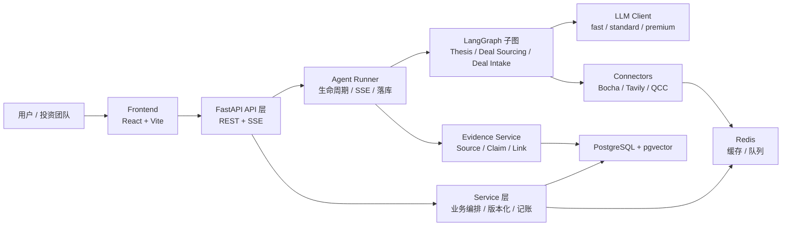
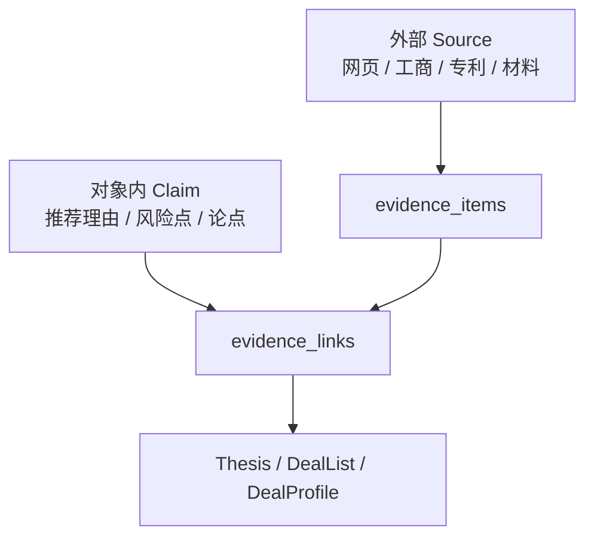
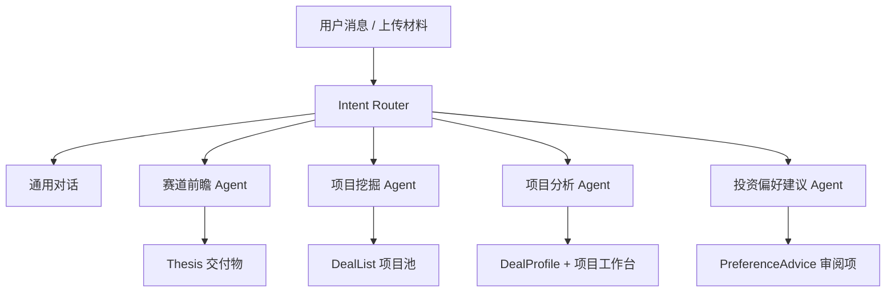
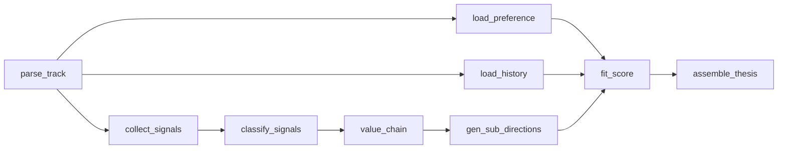
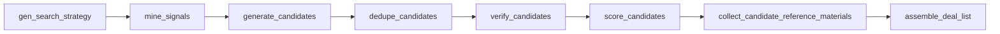
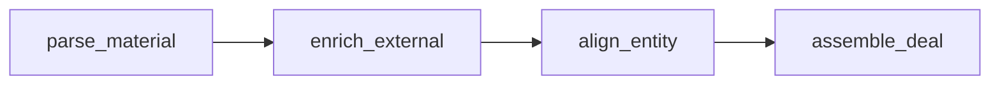
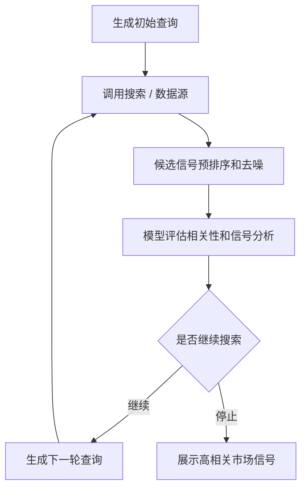

# AtomCAP

AtomCAP 是一个面向一级市场投资机构的多 Agent 投研工作台。系统围绕「赛道研究、项目挖掘、项目工作台、投资偏好、经验沉淀」组织业务能力，用结构化对象、证据链和可见 ReAct 工作过程把大模型能力落到可审计、可复用的投资流程中。

本文档按当前代码库状态整理，目标是让新接手的开发人员能够快速理解项目边界、架构分层、主要功能模块、关键数据对象、启动方式和后续开发路径。

## 当前状态

截至 2026-06-28，AtomCAP 已具备一套可运行的 MVP：

- 前端：React + Vite + Tailwind CSS，主入口为首页工作台、项目工作台、赛道库、项目库、投资偏好管理。
- 后端：FastAPI + SQLAlchemy Async + PostgreSQL/pgvector + Redis + LangGraph + SSE。
- Agent：已落地通用对话、赛道前瞻、项目挖掘、项目分析、投资偏好建议、市场信号 ReAct 收集、经验沉淀反哺等链路。
- 数据源：博查、Tavily、企查查 Connector 已有实现或可插拔实现，并带缓存和合规开关。
- 投资偏好：支持多张命名偏好卡片，每个维度都有「偏好」和「反偏好」，支持补充说明，并会作为当前机构偏好注入大模型推理。
- 项目工作台：支持项目状态流转、近期市场信号、项目材料、Pre-DD 资料、Pre-DD Brief 多版本生成。
- 证据链：赛道详情、项目池、市场信号、材料等对象都围绕 Source / Claim / EvidenceLink 设计，尽量避免无来源结论。

## 产品定位

AtomCAP 服务的核心场景不是通用聊天，而是投资机构内部的投研与项目管理协作。

主要用户包括：

- 投资人：希望快速获得赛道机会、候选项目、风险点和推荐理由。
- 分析师：需要围绕项目材料、公开市场信号、工商信息和投资偏好生成可追溯研究结论。
- 投委会或合伙人：需要看到项目状态、Pre-DD 资料完整度、关键论点证据和机构偏好匹配情况。

AtomCAP 的核心设计原则：

- 输出不是纯文本，而是可持久化、可点击、可追溯的业务对象。
- Agent 的执行过程以可见 ReAct 方式展示给用户，但不暴露模型隐藏推理。
- 每条重要结论都尽量绑定证据；无法绑定时标记为模型推断。
- 投资偏好是长期资产，用户显式配置和行为经验沉淀会共同影响后续推荐。

## 总体架构



### 分层说明

后端按「对象契约 → 服务 → Agent → API」组织：

- `backend/app/objects`：系统对象 Pydantic Schema，是前后端契约和强校验源头。
- `backend/app/models`：SQLAlchemy ORM，负责数据库表结构。
- `backend/app/services`：业务服务层，负责对象读写、事件记账、偏好版本化、市场信号收集、材料处理等。
- `backend/app/agents`：意图路由、LangGraph 子图、ReAct 可见计划、Runner 编排。
- `backend/app/connectors`：外部数据源适配层，统一输出 Source。
- `backend/app/evidence`：证据落库和对象结论连边。
- `backend/app/api`：FastAPI 路由，面向前端提供 REST 和 SSE。

前端按「页面 shell → 领域管理器 → 对象视图」组织：

- `frontend/src/pages/ChatPage.tsx`：主工作台 shell，左侧栏、会话、模式切换、当前投资偏好卡片。
- `frontend/src/pages/WorkspacePage.tsx`：项目工作台详情页。
- `frontend/src/components/PreferenceManager.tsx`：投资偏好管理。
- `frontend/src/components/TrackManager.tsx`：赛道库管理。
- `frontend/src/components/DealManager.tsx`：项目库管理。
- `frontend/src/components/MarketSignalsPanel.tsx`：近期市场信号复用组件。
- `frontend/src/components/objects`：交付对象渲染注册表，包含 ThesisView、DealListView。
- `frontend/src/lib/api.ts`：前端 API 客户端和类型。

## 核心业务对象

AtomCAP 的输出都尽量落成结构化对象，而不是只把模型文本保存在消息里。

| 对象 | 后端 Schema | 数据表 | 用途 |
| --- | --- | --- | --- |
| Thesis | `objects/thesis.py` | `deliverables` | 赛道研究交付物，包含市场信号、产业链、子方向、建议和证据链 |
| DealList | `objects/deal_list.py` | `deliverables` | 候选项目池，包含项目卡片、相关资料、推荐理由、风险点和证据 |
| DealProfile | `objects/deal.py` | `deals` | 单项目画像，项目工作台的核心数据 |
| InvestmentPreference | `objects/preference.py` | `preferences` | 当前机构生效投资偏好，版本化 |
| PreferenceProfile | `objects/preference_profile.py` | `preference_profiles` | 用户自建命名偏好卡片，可应用为当前偏好 |
| EvidenceItem | `objects/evidence.py` | `evidence_items` | 外部网页、工商资料、材料、模型来源等证据源 |
| EvidenceLink | `objects/evidence.py` | `evidence_links` | 交付对象和证据源之间的引用关系 |
| UserAction | `objects/experience.py` | `user_actions` | 用户行为记录，用于经验沉淀 |
| ExperienceEvent | `objects/experience.py` | `experience_events` | 从行为中抽取出的偏好/反偏好/风险边界信号 |
| PreferenceAdvice | `objects/experience.py` | `preference_advice` | 经验沉淀 Agent 给出的偏好更新建议 |

### 证据链约定

业务对象中的重要结论通常以 Claim 表示：

- Claim 有 `text`、`evidence_ids`、`inferred` 等字段。
- `evidence_ids` 指向 `evidence_items` 中的 Source。
- 如果模型生成了结论但没有有效证据，系统会把该 Claim 标记为 `inferred=true`。
- Runner 成功落库时会剥除无效 evidence id，避免对象引用不存在的证据。



## 系统功能模块

### 1. 登录、首页和全局工作台

相关文件：

- 后端：`api/auth.py`、`api/home.py`、`services/conversations.py`
- 前端：`pages/LoginPage.tsx`、`pages/ChatPage.tsx`、`lib/auth.tsx`

功能点：

- 用户注册机构并登录，后端签发 JWT。
- 首页通过 `/api/home` 聚合首屏数据：用户、机构、当前偏好、最近会话、交付物、项目摘要和统计。
- 左侧栏包含新对话、项目库、赛道库、投资偏好、最近会话、当前投资偏好卡片和账户设置。
- 当前投资偏好卡片展示当前生效偏好名、版本、偏好、反偏好和补充说明，卡片内部可滚动查看全部维度。
- 最近会话列表独立滚动，底部偏好卡片固定占位。

### 2. 对话与可见 ReAct 流程

相关文件：

- 后端：`api/conversations.py`、`agents/router.py`、`agents/react_planner.py`、`agents/runner.py`
- 前端：`lib/chatSession.tsx`、`pages/ChatPage.tsx`

功能点：

- 用户消息进入 `/api/conversations/{id}/messages`，通过 SSE 返回事件。
- 后端先做意图分类，再进入对应 Agent 或普通对话。
- 系统会输出可见 ReAct 工作过程：当前状态判断、下一步计划、工具调用、工具结果、最终交付。
- 前端把 ReAct 步骤以对话形式展示，工具调用可展开查看具体操作和结果。
- ReAct 步骤会持久化到消息 blocks 中，切换会话后仍能看到工作过程。
- 通用对话支持模型档位切换，支持 token usage 展示。

SSE 事件主要包括：

- `progress`：进度文本。
- `token`：模型正文增量。
- `react_step`：可见 ReAct 步骤。
- `object`：生成的交付对象引用。
- `usage`：token 用量。
- `error`：错误。
- `done`：结束。

### 3. 意图路由

相关文件：

- `agents/router.py`
- `api/conversations.py`

当前意图：

- `chat`：通用对话。
- `thesis_scout`：赛道前瞻，生成 Thesis。
- `deal_sourcing`：项目挖掘，生成 DealList。
- `deal_intake`：分析用户给定的单个项目，生成 DealProfile 并创建项目工作台。
- `preference_advice`：偏好/反偏好修改建议，进入人工审阅队列。



### 4. 赛道库和赛道详情

相关文件：

- 后端：`api/deliverables.py`、`services/theses.py`、`services/thesis_market_signals.py`
- Agent：`agents/thesis_scout`
- 前端：`components/TrackManager.tsx`、`components/objects/ThesisView.tsx`

功能点：

- 赛道库以卡片形式展示机构已创建或 Agent 生成的 Thesis。
- 赛道库支持搜索、删除、AI 助手自然语言创建和筛选。
- 赛道详情包含：
  - 赛道判断。
  - 近期市场信号。
  - 产业链视图。
  - 子方向推荐。
  - 代表公司。
  - 风险点和建议。
  - 证据链弹窗。
- 市场信号按五类整理：财经新闻、工商信息、专利信息、学术论文、人事变动。
- 市场信号支持再次收集，并按当前设置的搜索深度执行 ReAct 搜索。
- 赛道详情中的市场信号、产业链相关资料和证据链论据应跳转到对应网页或材料，而不是触发关键词搜索。
- Thesis 可以触发「生成项目池」，进入项目挖掘 Agent。

赛道前瞻子图：



### 5. 项目挖掘和候选项目池

相关文件：

- 后端：`agents/deal_sourcing`、`api/deliverables.py`
- 前端：`components/objects/DealListView.tsx`

功能点：

- 用户可以直接要求系统推荐项目，也可以从赛道详情中生成项目池。
- 系统会持续搜索和筛选，直到候选项目池基本可用后再呈现。
- 生成项目前会检查当前项目库：
  - 已在项目库中的项目显示为「已在项目库中」。
  - 支持筛选「已在项目库中 / 未在项目库中」。
- 每个项目卡片包含：
  - 项目名称、方向、别名、初始评分。
  - 相关资料链接。
  - 推荐理由，要求 3-5 条，每条至少一个证据。
  - 风险点，要求 3-5 条，每条至少一个证据。
  - 查看证据弹窗。
- 「筛选理由」已经移除，项目卡片只保留「推荐理由」和「风险点」两类判断。

项目挖掘子图：



关键实现：

- `gen_search_strategy` 会根据用户请求、赛道上下文和机构偏好拆搜索策略。
- `mine_signals` 调用 Connector 收集公开信号。
- `generate_candidates` 从信号反推公司。
- `dedupe_candidates` 做名称规范化、别名合并和实体去重。
- `verify_candidates` 调用工商源核验主体，补全公司名、统一社会信用代码和工商证据。
- `score_candidates` 根据偏好、证据和风险进行评分。
- `collect_candidate_reference_materials` 尽量补齐官网、近期重要资料、新闻和公告。

### 6. 项目库和项目工作台

相关文件：

- 后端：`api/deals.py`、`services/deals.py`、`services/deal_materials.py`、`services/deal_market_signals.py`、`services/pre_dd.py`、`services/pre_dd_brief.py`
- Agent：`agents/deal_intake`
- 前端：`components/DealManager.tsx`、`pages/WorkspacePage.tsx`

项目库功能点：

- 项目库支持搜索、删除、AI 助手自然语言创建和筛选。
- 项目卡片展示公司名、状态、匹配度、入库状态。
- 点击项目进入项目工作台。

项目工作台功能点：

- 项目名称下方展示项目状态迁移图。
- 状态流转：
  - 初始状态：`初筛中`。
  - 初筛中可点击「立项」进入 `尽调中`，或点击「否决」进入 `已否决`。
  - 尽调中可点击「划款」进入 `进行中`，或点击「否决」进入 `已否决`。
  - 进行中可点击「退出」进入 `已退出`。
  - 已否决和已退出为终态。
- 项目工作台包含：
  - 项目画像。
  - 项目材料。
  - 近期市场信号。
  - Pre-DD 资料。
  - Pre-DD Brief。
  - 关联公司工商信息。
  - 推荐下一步。

项目分析子图：



#### 项目材料

项目材料支持上传文件和材料归类：

- 支持 PDF、Word、Excel、CSV、TXT 等文本型材料。
- 在「初筛中」阶段上传材料后，系统会读取材料内容并判断其属于 14 个 Pre-DD 资料维度中的哪一类。
- 若 14 类都不匹配，则建议归类为「背景材料」。
- 材料可作为项目材料证据，被市场信号、证据链和 Pre-DD Brief 引用。

#### 近期市场信号

项目工作台和赛道详情均复用市场信号逻辑：

- 五类信号：财经新闻、工商信息、专利信息、学术论文、人事变动。
- 用户可按类别筛选。
- 用户可点击「再次收集」重新触发收集。
- 每条信号包含「信号分析」，用几句话说明与当前项目或赛道的关系、启发和核验重点。
- 搜索逻辑采用 ReAct：先搜索，再由模型研判候选，决定是否继续下一轮搜索。
- 用户可在设置中配置搜索深度；测试阶段默认深度为 1。

市场信号 ReAct：



#### Pre-DD 资料

当前设计为 14 个 Pre-DD 资料维度：

- BP / 产品宣传材料。
- 股东与股权结构。
- 组织架构与核心人员。
- 业务模式。
- 营销模式。
- 盈利模式。
- 财务指标数据。
- 上游供应商。
- 下游大客户。
- 竞争对手。
- 市场规模和增长。
- 核心管理团队简历、员工花名册。
- 融资和估值说明。
- 未来发展方向或合作诉求。

每个资料项包含：

- 简介：一句话说明需要收集的材料。
- 已收集材料：包括系统捕获公开信息和机构上传材料。
- 待收集建议：如果系统认为足够，则显示「材料收集完成」。
- 状态：已收集 / 待收集，用户可手动切换。
- 上传资料按钮：允许用户对每个资料项上传材料。

#### Pre-DD Brief

Pre-DD Brief 独立于 Pre-DD 资料卡片：

- 用户点击「生成 Pre-DD Brief」后，系统根据当前资料情况生成 Brief。
- 支持多版本生成。
- 用户可点击不同版本查看历史 Brief。

### 7. 投资偏好管理

相关文件：

- 后端：`api/preferences.py`、`api/preference_profiles.py`、`services/preferences.py`、`services/preference_profiles.py`、`services/preference_assistant.py`
- 前端：`components/PreferenceManager.tsx`、`pages/ChatPage.tsx`
- 反哺层：`agents/experience/influence.py`

功能点：

- 用户可创建多张命名投资偏好卡片。
- 每张偏好卡片包含固定维度：
  - 赛道。
  - 融资阶段。
  - 所在地域。
  - 风险偏好。
  - 融资规模。
- 用户可新增自定义偏好维度。
- 每个维度都有两类取值：
  - 偏好：机构喜欢的特性，是赛道或项目的加分项。
  - 反偏好：机构厌恶的特性，是赛道或项目的减分项。
- 用户可新增和删除补充说明；补充说明会随当前投资偏好交给大模型作为推理参考。
- 偏好卡片可以应用为机构当前生效偏好。
- 当前生效偏好是版本化的，写入 `preferences` 表。
- 左侧边栏下方的「当前投资偏好」卡片展示偏好、反偏好和补充说明，并提供内部滚动条。
- 投资偏好管理页支持搜索、删除、AI 助手自然语言创建和筛选。

应用偏好时的映射：

- 正向维度进入 `declared_strategy.focus_*` 和 `learned_preference` 的高权重项。
- 反偏好进入 `declared_strategy.anti_*`、`anti_preference.disliked_*` 和遗留兼容字段 `excluded_tracks`。
- 补充说明进入 `supplemental_notes` 和 `declared_strategy.supplemental_notes`。

推荐和评分时：

- `agents/experience/influence.py` 会把声明偏好转成评分可读的权重表。
- 命中偏好会提高项目或赛道匹配度。
- 命中反偏好会降低匹配度或生成风险提示。

### 8. 经验沉淀和偏好建议

相关文件：

- 后端：`objects/experience.py`、`services/user_actions.py`、`services/experience_distillation.py`、`services/preference_advice.py`
- Agent：`agents/experience`
- API：`api/experience.py`、`api/preference_advice.py`

功能点：

- 用户行为会结构化为 UserAction。
- 系统可以从行为中提取 ExperienceEvent。
- 强偏好信号会生成 PreferenceAdvice。
- Advice 进入人工审阅队列，用户接受后才会改写当前偏好。
- 接受 Advice 后会创建新的 active Preference 版本，旧版本保留审计。
- 无可执行变更时不会制造噪声偏好版本。

设计原则：

- 经验沉淀 Agent 只能提出建议，不能绕过用户直接改偏好。
- 显式偏好/反偏好优先级高于行为推断。
- 所有偏好变更都写 domain_events，便于审计。

### 9. 数据源 Connector

相关文件：

- `connectors/base.py`
- `connectors/registry.py`
- `connectors/bocha.py`
- `connectors/tavily.py`
- `connectors/qcc.py`
- `connectors/cache.py`

Connector 统一输出 `Source`，供 Agent、市场信号和证据链复用。

当前数据源：

- 博查：Web 搜索。
- Tavily：全局搜索、新闻、资料检索。
- 企查查：工商照面、股东、对外投资等企业信息。

关键约定：

- 数据源按 key 是否配置启用。
- `allow_overseas_models` 类似合规闸门，控制海外源和海外模型使用。
- 搜索结果会做 URL 去重、时间截断、噪声过滤和缓存。
- Redis 缓存默认 TTL 24h，配置为 `SIGNAL_CACHE_TTL_SECONDS`。

### 10. 模型路由

相关文件：

- `llm/client.py`
- `api/models.py`
- `litellm/config.yaml`

系统业务代码只使用模型档位，不直接写死具体模型：

- `fast`：轻量分类、候选生成、推荐候选。
- `standard`：结构化分析、候选研判。
- `premium`：高价值最终组装、复杂判断。
- `embed`：向量化预留。

Provider 选择：

- `LLM_PROVIDER=auto` 时优先使用 DeepSeek key，其次 OpenAI key，都没有则回退本地 LiteLLM 网关。
- 机构级 `allow_overseas_models` 控制海外模型和海外数据源。
- 前端可读取 `/api/models` 并在对话框中切换可用档位。

## 数据库模型概览

主要表：

- `institutions`：机构。
- `users`：用户。
- `conversations` / `messages`：会话和消息，消息 blocks 保存 text、object_ref、usage、react_steps 等结构。
- `preferences`：当前生效投资偏好，版本化。
- `preference_profiles`：用户自建偏好卡片。
- `agent_runs`：Agent 运行生命周期。
- `domain_events`：领域事件流水。
- `companies` / `persons` / `deals`：业务对象。
- `deliverables`：Thesis、DealList 等交付对象。
- `evidence_items` / `evidence_links`：证据源与对象引用关系。
- `documents` / `chunks`：文档和 RAG 预留。
- `user_actions` / `experience_events` / `preference_advice`：经验沉淀链路。

启动时 `main.py` 会尝试 `CREATE EXTENSION vector` 和 `Base.metadata.create_all`，避免开发环境新表缺失导致 500。生产仍应以 Alembic 迁移为准。

## API 模块概览

| 路由前缀 | 文件 | 用途 |
| --- | --- | --- |
| `/api/auth` | `api/auth.py` | 注册、登录 |
| `/api/home` | `api/home.py` | 首页聚合数据 |
| `/api/models` | `api/models.py` | 可用模型档位 |
| `/api/conversations` | `api/conversations.py` | 会话列表、消息 SSE、上传材料 |
| `/api/deliverables` | `api/deliverables.py` | Thesis / DealList 交付物、赛道助手、市场信号、生成项目池 |
| `/api/deals` | `api/deals.py` | 项目库、项目详情、市场信号、材料、Pre-DD、状态流转 |
| `/api/preferences` | `api/preferences.py` | 当前机构生效偏好 |
| `/api/preference-profiles` | `api/preference_profiles.py` | 命名偏好卡片 CRUD、应用、推荐、偏好助手 |
| `/api/preference-advice` | `api/preference_advice.py` | 偏好建议生成、队列、审阅 |
| `/api/experience` | `api/experience.py` | 经验扫描 |

## 目录结构

```text
AtomCAP-dev/
  backend/
    app/
      agents/            # 意图路由、ReAct 计划、LangGraph 子图、Runner
      api/               # FastAPI 路由
      connectors/        # 博查 / Tavily / 企查查 / 缓存
      evidence/          # 证据落库与连边
      llm/               # 模型档位路由与结构化输出
      models/            # SQLAlchemy ORM
      objects/           # Pydantic 业务对象契约
      services/          # 业务服务层
      main.py            # FastAPI app 入口
    alembic/             # 数据库迁移
    tests/               # 后端测试
    worker/              # ARQ worker
    pyproject.toml
  frontend/
    src/
      components/        # 领域组件和交付对象渲染
      lib/               # API、鉴权、会话状态、设置
      pages/             # ChatPage / WorkspacePage / LoginPage
      index.css
    package.json
  litellm/
    config.yaml          # LiteLLM 模型档位配置
  docker-compose.yml
  .env.example
  技术规划.md
  agent_design/
```

## 本地启动

### 1. 准备环境变量

```bash
cp .env.example .env
```

至少需要确认：

- `DATABASE_URL`
- `REDIS_URL`
- `JWT_SECRET`
- 一个可用模型入口：DeepSeek、OpenAI 或本地 LiteLLM。
- 可选数据源：`BOCHA_API_KEY`、`QCC_APP_KEY`、`QCC_SECRET_KEY`、`TAVILY_API_KEY`。

开发时可把 `.env` 中 `AUTH_DEV_FALLBACK=true` 打开；生产必须关闭。

### 2. 启动基础服务

```bash
docker compose up -d postgres redis litellm
```

如果你希望后端和 worker 也用 Docker：

```bash
docker compose up -d backend worker
```

### 3. 启动后端

Windows PowerShell：

```powershell
cd backend
python -m venv .venv
.\.venv\Scripts\Activate.ps1
pip install -e ".[dev]"
alembic upgrade head
uvicorn app.main:app --reload
```

macOS / Linux：

```bash
cd backend
python -m venv .venv
source .venv/bin/activate
pip install -e ".[dev]"
alembic upgrade head
uvicorn app.main:app --reload
```

后端文档：

- 健康检查：http://localhost:8000/healthz
- OpenAPI：http://localhost:8000/docs

### 4. 启动前端

```bash
cd frontend
npm install
npm run dev
```

前端默认地址：http://localhost:5173

### 5. 启动 Worker

如果需要跑后台任务：

```bash
cd backend
arq worker.main.WorkerSettings
```

## 测试和质量检查

### 后端测试

推荐使用项目虚拟环境：

```powershell
backend\.venv\Scripts\python.exe -m pytest
```

常用局部测试：

```powershell
backend\.venv\Scripts\python.exe -m pytest backend/tests/test_preference_profiles.py
backend\.venv\Scripts\python.exe -m pytest backend/tests/test_preference_influence.py
backend\.venv\Scripts\python.exe -m pytest backend/tests/test_deals.py
backend\.venv\Scripts\python.exe -m pytest backend/tests/test_deal_sourcing_nodes.py
```

### 前端构建

```bash
cd frontend
npm run build
```

### Lint

后端配置了 Ruff：

```bash
cd backend
ruff check app tests
```

## 开发指南

### 新增一个后端业务对象

建议顺序：

1. 在 `backend/app/objects` 增加 Pydantic Schema。
2. 如需落库，在 `backend/app/models/models.py` 增加 ORM 表或扩展 JSONB 字段。
3. 在 `backend/app/services` 写纯业务读写逻辑。
4. 在 `backend/app/api` 暴露路由。
5. 如果对象会被 Agent 生成，接入 `agents/runner.py` 的强校验和落库。
6. 增加 tests，优先覆盖 schema 清洗、服务层纯函数和 API 守卫。

### 新增一个 Agent 节点

建议顺序：

1. 在对应 `agents/<agent>/schemas.py` 定义结构化输出。
2. 在 `nodes.py` 实现节点，尽量保持节点纯函数或显式依赖注入。
3. 在 `graph.py` 接入 LangGraph。
4. 在 `runner.py` 对节点执行过程追加可见 ReAct 步骤。
5. 对外部数据源和模型调用设置空输入守卫，避免无意义调用。
6. 写离线单测；外部 API 用 MockTransport 或 monkeypatch。

### 新增一个外部数据源

建议顺序：

1. 在 `connectors/base.py` 对齐 Source 字段。
2. 新建 `connectors/<source>.py`。
3. 在 `connectors/registry.py` 注册。
4. 明确 region、合规开关和 key 缺失行为。
5. 写解析契约测试，覆盖鉴权头、正常响应、空响应、错误降级。

### 新增前端领域页面

建议顺序：

1. 在 `lib/api.ts` 增加 API 函数和类型。
2. 在 `components` 新建领域管理器组件。
3. 如需进入主工作台，在 `ChatPage.tsx` 增加 mode。
4. 如需对象渲染，在 `components/objects/registry.tsx` 注册。
5. 跑 `npm run build`，确保 noUnusedLocals 和类型检查通过。

## 重要实现约定

### 1. 业务代码只使用模型档位

不要在业务逻辑中写具体模型名。使用：

- `ModelTier.FAST`
- `ModelTier.STANDARD`
- `ModelTier.PREMIUM`

具体模型由 `.env` 或 `litellm/config.yaml` 配置。

### 2. 证据优先

新增推荐理由、风险点、论点时，优先绑定已有 Source。没有证据时必须清楚标记为推断，避免把模型判断伪装成事实。

### 3. domain_events 是审计主线

用户关键行为、对象创建、偏好更新、Agent run 状态变化都应写 `domain_events`。

### 4. 投资偏好分为三层

- PreferenceProfile：用户在 UI 中维护的多张命名卡片。
- InvestmentPreference：机构当前生效偏好，版本化，供 Agent 使用。
- LearnedPreference / Experience：从用户行为中学习出的偏好反哺，必须经审阅。

### 5. ReAct 展示不是隐藏推理

前端展示的是模型生成的「状态评估、下一步计划、工具调用、观察结果」，不是模型隐藏思维链。新增 Agent 时应继续遵守这个边界。

## 常见问题

### 1. 前端提示后端未启动

确认：

- `uvicorn app.main:app --reload` 已启动。
- 后端端口为 8000。
- 前端 `api.ts` 中的 base URL 与后端一致。
- 登录 token 存在或 `AUTH_DEV_FALLBACK=true`。

### 2. 新表不存在导致 500

开发环境：

```bash
cd backend
alembic upgrade head
```

另外，`main.py` 启动时会尝试自动 `create_all`，但生产仍应使用 Alembic。

### 3. Agent 搜索不到结果

检查：

- 数据源 key 是否配置。
- `allow_overseas_models` 是否阻断了海外源。
- Redis 缓存是否返回旧空结果。
- 市场信号搜索深度是否为 1。

### 4. LLM 请求卡住

检查：

- `LLM_PROVIDER` 和 key。
- `LLM_REQUEST_TIMEOUT_SECONDS`。
- 本机是否需要 `LLM_HTTP_PROXY`。
- LiteLLM 是否启动并可访问。

## 近期重点维护区域

当前代码仍在快速迭代，最容易受需求影响的区域：

- `frontend/src/pages/ChatPage.tsx`：主工作台 shell，历史上承载了较多模式和会话展示逻辑。
- `frontend/src/pages/WorkspacePage.tsx`：项目工作台，包含材料、Pre-DD、状态流转、市场信号等多个子域。
- `frontend/src/components/PreferenceManager.tsx`：投资偏好 UI，包含偏好/反偏好、补充说明、历史版本、AI 助手。
- `backend/app/api/conversations.py`：SSE、意图路由、ReAct 展示、通用对话和 Agent 分发都在这里汇合。
- `backend/app/agents/runner.py`：交付对象落库、证据连边、ReAct 步骤和消息持久化的关键编排。
- `backend/app/services/market_signal_research.py`：近期市场信号 ReAct 搜索和去噪逻辑。

## 后续路线建议

优先级较高的工程任务：

- 把长 Agent run 从请求内联迁移到 ARQ 队列，SSE 只订阅 run 状态。
- 增强市场信号真实数据源质量，减少技术文档、题库、教程类噪声。
- 给项目材料增加 OCR 和旧版 Office 文档支持。
- 强化候选项目实体对齐：官网、创始人、统一社会信用代码、融资主体多维匹配。
- 引入 Langfuse 或等价观测平台，沉淀 Agent 运行质量数据。
- 为前端关键页面补端到端测试或截图回归测试。

## 参考资料

- [技术规划.md](./技术规划.md)
- [MVP功能设计.docx](./MVP功能设计.docx)
- [AtomCAP_商业计划书_0616.docx](./AtomCAP_商业计划书_0616.docx)
- [agent_design/](./agent_design)
