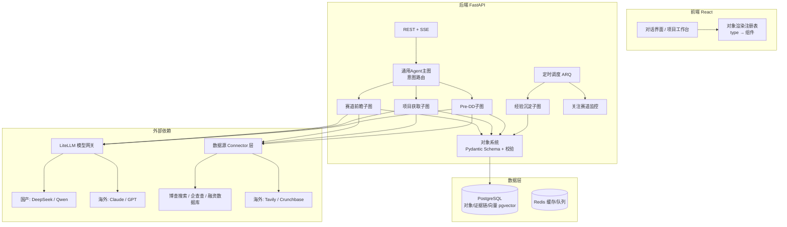

# AtomCAP MVP 技术规划

> 基于《功能设计》与《赛道前瞻Agent》两份设计文档制定。2026-06-11。

## 1. 一句话定位与核心架构判断

AtomCAP 不是一个聊天产品，而是一个**以"交付结果对象"为中心的投资工作系统**，Agent 只是对象的生产者。这决定了架构的中心不是对话流，而是**对象系统（Object System）+ 证据链（Evidence Chain）**。所有技术决策围绕三件事展开：

1. **对象优先**：每个 Agent 的输出都是经 Schema 严格校验的结构化对象，可被存储、引用、再加工，而非一次性文本。
2. **证据链是一等公民**：从第一天起，每个结论字段都必须能回溯到来源。这是产品的合规卖点，后补的成本极高。
3. **模型可切换**：开发期用国产模型，保留一键切换海外模型的能力（按任务档位路由，而非全局替换）。

## 2. 总体架构



## 3. 技术选型

| 层 | 选型 | 理由 |
|---|---|---|
| 后端语言/框架 | Python 3.12 + FastAPI + Pydantic v2 | 团队偏好；AI 生态最全；**Pydantic Model 一处定义，同时充当 LLM 结构化输出约束、API 校验、对象入库校验、前端类型来源（经 OpenAPI 导出）** |
| Agent 编排 | LangGraph | 2026 年生产级有状态工作流的事实标准；赛道前瞻的 8 步工作流可直接映射为图节点；自带 checkpoint 持久化（中断恢复）、interrupt（人工确认）、流式事件——这三个能力 AtomCAP 全要用到 |
| LLM 网关 | LiteLLM（自部署，**镜像固定版本号**） | 统一 OpenAI 格式接入国内外全部模型；alias 路由 + fallback + 成本统计。国产模型（DeepSeek V4、Qwen3.5）均已 OpenAI 兼容且 function calling 可靠 |
| 模型档位 | `fast` / `standard` / `premium` 三档别名 | fast：拆解、分类、抽取（DeepSeek-V3.2 / Qwen 轻量档）；standard：综合推理（DeepSeek-V4 / Qwen3.5）；premium：用户要求高质量交付时切 Claude / GPT。**代码只引用档位别名，切换模型零改动** |
| Embedding | BGE-M3（自部署）或 Qwen text-embedding | 中英双语，国内外双市场通用 |
| 数据库 | PostgreSQL 16 + pgvector + JSONB | 一库三用：关系数据、对象 JSONB、向量检索。MVP 不引入独立向量库和图数据库；证据链用邻接表建模，规模上来后再评估 Neo4j |
| 缓存/队列 | Redis + ARQ | ARQ 是 asyncio 原生的轻量任务队列，承担长任务与 cron（关注赛道定期更新、经验沉淀）；比 Celery 轻，与 FastAPI 同一异步模型 |
| 文档解析 | MinerU（国产开源） | Pre-DD 阶段解析 BP/财报 PDF，表格还原质量好；备选 unstructured |
| 前端 | React 18 + TypeScript + Vite + shadcn/ui + Tailwind | 组件质量高、定制自由，适合做"对象卡片"这种非标 UI |
| 前端状态/通信 | TanStack Query + SSE（fetch-event-source） | 对话流式输出 + Agent 长任务进度推送统一走 SSE，MVP 不需要 WebSocket |
| 图谱可视化 | React Flow | 产业链图谱（MVP 按设计文档做静态结构图）与证据链展开视图 |
| 可观测/评测 | Langfuse（自部署） | LLM tracing、prompt 版本管理、评测集运行，国内可私有化部署 |
| 部署 | Docker Compose 单机起步（国内阿里云） | 海外市场后期在 AWS 起第二区，服务无状态化保证可复制；两区数据不互通（合规） |

## 4. 数据模型设计

三类对象对应的核心表（均带 `institution_id` 实现多租户行级隔离）：

**租户与系统对象**

- `institutions` / `users`：机构 → 用户两级，JWT 认证
- `conversations` / `messages`：message 的 content 为块数组——文本块与**对象引用块**混排，这是前端混合渲染的基础
- `preferences`：机构投资偏好的结构化对象（赛道偏好、阶段、地域、风险偏好、不感兴趣清单），是 fit_score 的输入；版本化，变更需人工确认
- `agent_runs`：每次 Agent 执行的完整审计（agent 类型、各步骤输入输出摘要、token、成本、状态），排障与成本控制依赖它
- `domain_events`：**所有用户操作与对象状态流转的事件流水**（关注赛道、生成项目池、立项、否决、证伪……）。这是投资经验沉淀 Agent 的唯一数据来源，必须从 Phase 0 就开始记账，事后无法补

**业务对象**

- `companies` / `deals` / `persons`：固定列（名称、统一社会信用代码、状态机字段）+ JSONB profile。deal 状态流转由系统管控并写入 `domain_events`

**交付结果对象**

- `deliverables` 单表多类型：`(id, institution_id, type, schema_version, payload JSONB, status, source_conversation_id, created_by_run_id)`
- type 枚举：`thesis` / `deal_list` / `dd_report` / `briefing` / `lp_report`……每个 type 对应一个 Pydantic Schema，**入库前强制校验，校验不过的 LLM 输出自动重试修复**
- Thesis 的 payload 即设计文档的字段表（thesis_name、one_line_view、sub_directions、investment_reason、evidence、institution_fit_score、recent_signals、representative_companies、key_risks、recommended_actions、created_from_conversation、status）
- schema_version 必须有：对象会长期存储并被再加工，Schema 必然演进

**证据链**

- `evidence_items`：`(claim, source_type, source_url, snippet, retrieved_at, confidence)`——检索到的每条原始材料落库
- `evidence_links`：`(from_id, to_id, relation)` 邻接表，把证据与结论、对象与对象连成图
- **约定：交付对象 payload 中每个结论性字段携带 `evidence_ids` 数组；没有证据支撑的结论必须显式标记为"模型推断"**。前端任意结论可展开证据面板

**RAG（机构私有信息）**

- `documents` / `chunks(embedding)`：上传文档解析、切块、向量化，pgvector 混合检索（向量 + 全文）

## 5. Agent 层设计

### 5.1 通用 Agent（主图）与触发机制

主图入口是一个**结构化意图路由节点**：用 fast 档模型做分类（`chat` / `thesis_scout` / `deal_sourcing` / 工作台动作），命中专用意图则进入对应子图，否则走通用对话（带工具：私有库检索、对象查询）。不要用关键词规则做触发——设计文档中的触发语句（"人形机器人上游还能不能投？"）形态太多样，LLM 分类 + 置信度阈值，低置信度时向用户确认。

### 5.2 赛道前瞻 Agent（8 步 → LangGraph 子图）

设计文档的工作流直接映射为节点，每个节点完成即写 checkpoint 并经 SSE 推送进度（前端显示"正在收集市场信号…"）：

```
parse_track（赛道定义拆解，fast档）
  → 并行：collect_signals（多 Connector 并发检索）｜load_preference｜load_history
  → classify_signals（热度信号 vs 结构性信号，结构性加权——设计文档的核心要求）
  → value_chain（产业链上中下游拆解 + 各环节毛利/进入难度/阶段适配判断）
  → gen_sub_directions（3–7 个子赛道，standard/premium档）
  → fit_score（机构匹配度分项评分）
  → assemble_thesis（组装 + Pydantic 校验 + evidence_ids 绑定 + 落库）
```

- 全程 1–5 分钟，作为 ARQ 异步任务执行，对话中先返回任务卡片，完成后推送 Thesis 对象
- **fit_score 实现**：按设计文档公式（赛道偏好 + 阶段 + 壁垒 + 地域 + 风险偏好 + 历史相似度 − 不感兴趣惩罚）做成 rubric：每个因子由 LLM 按评分标准打分并给理由，历史相似度用 embedding 相似度计算，加权求和。**分项得分与理由全部保留**，前端可解释"为什么是 82 分"
- 信号检索按赛道做 24h 缓存，避免重复烧 API 成本
- 四个推荐动作（生成项目池/关注该赛道/生成赛道简报/重新推荐）作为对象上的 action 按钮，点击即发起新的 agent run；"关注该赛道"将 Thesis 置为已关注，进入定时监控（cron 增量检索新信号 → 有实质变化时生成更新提醒）

### 5.3 项目获取 Agent

输入：Thesis 子赛道（或用户直接描述）。流程：多 Connector 检索候选公司 → **实体对齐**（公司名标准化 + 统一社会信用代码去重，这是国内数据的脏活，必须专门做）→ 创建/关联 `companies` 业务对象 → 初筛评分 → 产出 `deal_list` 对象（每项含公司引用、入选理由、evidence_ids、与子赛道的关联）。

### 5.4 Pre-DD Agent（项目工作台）

绑定具体 deal 后进入工作台，本质是一个**长期会话 + 信息清单（checklist）驱动的迭代流程**：

- checklist 对象按维度（团队/产品/技术/市场/财务/法务/竞争）列出立项会所需信息项及其完备状态
- 用户上传 BP、访谈纪要等 → MinerU 解析 → RAG 入库 → Agent 自动将信息归位到 checklist 并标注来源
- 缺口由 Agent 主动提示，用户可让 Agent 检索公开信息补全
- 产出 `dd_report` 对象，每节带证据链；关键判断节点用 LangGraph interrupt 留人工确认位

### 5.5 投资经验沉淀 Agent

消费 `domain_events` + 历史交付对象，cron 定期运行：提炼偏好更新建议（生成 preference diff，**人工确认后才生效**）、操作复盘（哪些 thesis 被证伪、哪些项目池转化为立项）、生成 LP 汇报对象。被证伪/被标记不符合偏好的记录回流为 fit_score 的历史因子——这就是设计文档说的"越用越准"。

## 6. 数据源 Connector 层

统一接口抽象（`search_news` / `company_lookup` / `funding_events` / `policy_search` / `patent_trends`），每个数据源实现为一个 Connector，可插拔、可按区域路由：

| 类型 | 国内 | 海外 |
|---|---|---|
| 网页/新闻搜索 | 博查 Bocha API | Tavily / Exa |
| 工商信息 | 企查查或天眼查开放平台 | OpenCorporates |
| 融资事件 | IT桔子 / 烯牛数据 | Crunchbase |
| 公告/政策 | 巨潮资讯、政府网站定向抓取 | SEC EDGAR |

MVP 原则：**先用"博查搜索 + 企查查"两个源把赛道前瞻跑通**，其余源按 Phase 递增。所有 Connector 返回统一的 `Source` 结构（url、标题、摘要、时间、原始数据），直接落 `evidence_items`。商业数据源按量计费较贵，先买小额度验证单位经济性。

## 7. 前端关键设计

- **对象渲染注册表**：`deliverable.type → React 组件`。ThesisView 按设计文档分六区：顶部核心信息卡片、子赛道卡片组（含按钮）、产业链静态结构图（React Flow）、近期市场信号列表（每条可展开证据链）、风险点、下一步操作
- 消息流渲染文本块与对象引用块混排；对象上的按钮回传 action 触发新 agent run
- SSE 双用途：token 级流式（普通对话）+ 步骤级进度（专用 Agent 长任务）
- EvidencePanel 全局复用：任何带 evidence_ids 的字段点击展开来源列表与原文摘录
- 后端 OpenAPI 导出 TS 类型（openapi-typescript），对象 Schema 前后端不漂移

## 8. 实施路线图（四个 Agent 全做，约 16–18 周）

按依赖关系串行验证，**每个 Phase 有明确验收标准，未达标不开下一个**：

| Phase | 周期 | 内容 | 验收标准 |
|---|---|---|---|
| 0 基座 | 2–3 周 | Monorepo 骨架；FastAPI + Postgres + LiteLLM + Langfuse；多租户 Auth；对话 + SSE 流式 + 通用 Agent；deliverables 表 + 对象渲染框架；domain_events 记账 | 能多轮对话；能渲染一个 mock Thesis 对象的全部六区 UI |
| 1 赛道前瞻 | 4 周 | Connector 框架 + 博查 + 企查查；8 步子图；证据链落库与展开；fit_score；动作先做"关注赛道"+"生成简报"；建 10 题 golden 评测集 | 输入"AI 硬件有什么机会"，3 分钟内产出带证据链的 Thesis，引用准确率达标 |
| 2 项目获取 + 工作台骨架 | 3 周 | deal_list 生成；companies 实体对齐；项目工作台列表/详情页；"生成项目池"动作打通 | Thesis → 项目池 → 工作台闭环走通 |
| 3 Pre-DD | 4 周 | 文档上传 + MinerU 解析 + RAG；checklist 对象与归位逻辑；dd_report 生成；interrupt 人工确认 | 上传 BP 后 checklist 自动归位；产出带证据链的 DD 报告 |
| 4 经验沉淀 + 监控 | 3 周 | 经验沉淀 cron 与 preference diff；关注赛道定期更新提醒；LP 汇报对象；整体打磨 | 偏好建议可确认生效；关注赛道有增量更新推送 |

贯穿全程：每 Phase 末跑 Langfuse 评测集；引用准确率（结论是否真有证据支撑）是第一指标。

## 9. 关键风险与对策

1. **LLM 幻觉 vs 证据链承诺**——产品卖点是"严密的可视化证据链"，这是最大技术风险。对策：无证据结论强制标"推断"；评测以引用准确率为第一指标；premium 档位用于最终组装步骤。
2. **数据源成本与质量**——商业 API 贵且质量参差。对策：Connector 可插拔随时换源；赛道级缓存；先小额度验证。注意爬虫的合规边界。
3. **长流程时延与成本**——8 步全跑一次成本不低。对策：档位路由（拆解分类用 fast，综合判断用 standard/premium）；信号缓存；agent_runs 成本看板。
4. **范围风险**——四个 Agent 全做但必须串行验收，赛道前瞻是价值验证的关键，Phase 1 质量不达标时宁可推迟后续 Phase。
5. **双市场合规**——国内用户数据不出境：切换海外模型做成机构级开关并显式提示；国内外两区数据物理隔离；国内上线前评估算法备案要求。

## 10. 仓库结构建议

```
AtomCAP-dev/
├── backend/
│   ├── app/
│   │   ├── api/            # 路由：对话、对象、工作台、Auth
│   │   ├── agents/         # 主图 + 四个子图（每个子图一个目录）
│   │   ├── connectors/     # 数据源适配器
│   │   ├── objects/        # 三类对象的 Pydantic Schema（系统核心）
│   │   ├── evidence/       # 证据链服务
│   │   ├── llm/            # LiteLLM 客户端与档位路由
│   │   └── services/       # 对象存取、RAG、评分、事件记账
│   ├── worker/             # ARQ 任务与 cron
│   └── tests/  evals/      # 单测 + golden 评测集
├── frontend/
│   └── src/
│       ├── components/objects/   # 对象渲染注册表与各对象组件
│       ├── pages/                # 对话首页、项目工作台
│       └── api/                  # openapi-typescript 生成的类型与客户端
└── docker-compose.yml      # postgres + redis + litellm + langfuse + 应用
```

---

*下一步建议：从 Phase 0 开始，先把 `objects/` 里的 Thesis Schema 用 Pydantic 写出来——它是整个系统的契约原点。需要的话我可以直接初始化项目骨架。*
